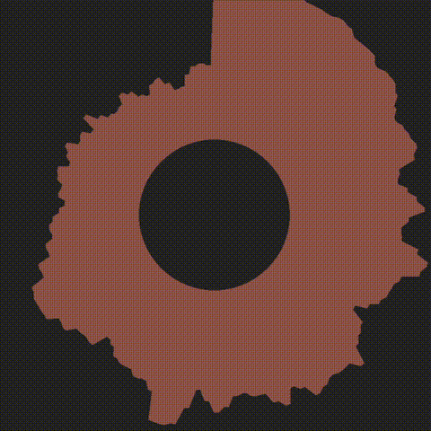

# Radial-Beat: A Circular Audio-Spectrum Visualizer  
*Python • Pygame • Librosa*

Turn any WAV track into a hypnotic, 360-degree bar spectrum that ripples and changes colour with every bass hit.

<br/>

## ✨ What it does

| Stage | Detail |
|-------|--------|
| **Analyse** | Uses **librosa** to convert the WAV file into an STFT spectrogram (dB scale). |
| **Slice**   | Breaks the spectrum into four tuneable bands (bass, heavy, low-mids, high-mids) and averages bins for each on every frame. |
| **Render**  | Creates a ring of `RotatedAverageAudioBar` objects around a centre circle in Pygame. Height ⇆ current dB, eased for smooth motion. |
| **React**   | Detects bass energy > threshold -> pulses circle radius & randomly shifts polygon colour. |

<br/>

## Preview

<p align="center">
  
</p>


## 🚀 Quick start

```bash
# install deps
pip install pygame librosa numpy matplotlib

# drop a WAV file in the repo root (default: 1kHz.wav)
python main.py                # launch visualizer
